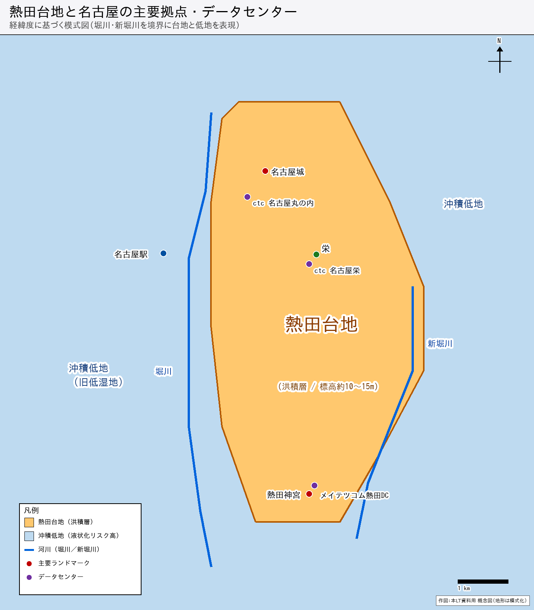
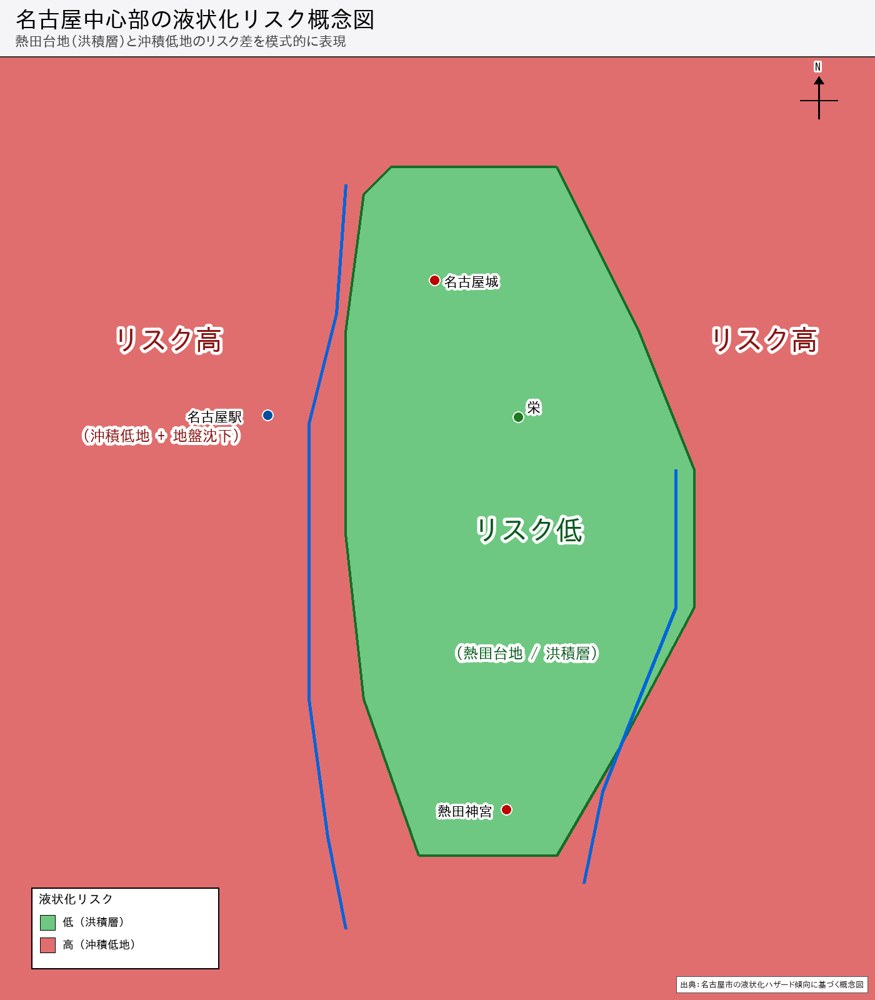

# 名古屋城とデータセンター

---

## 唐突な問い

名古屋市内で  
コロケーション・ハウジングサービスを提供するデータセンターの多く、  
どこに建っているか知っていますか？

---

## 名古屋の地形：台地と低湿地

- **熱田台地の上**：名古屋城・城下町（現在の栄周辺）・熱田神宮
- **低湿地（沖積低地）**：現在の名古屋駅周辺
- 西縁＝**堀川**（名古屋城築城（1610年）時の人工運河、熱田湊からの物資輸送路）
- 東縁＝**新堀川**（旧・精進川）

---

## 名古屋駅はなぜ「外れた場所」にあったのか

| | 江戸〜明治初期 | 現在 |
|---|---|---|
| 名古屋城 | 政治・軍事の中心 | 史跡 |
| 栄周辺 | 城下町・市街地 | 商業中心 |
| **名古屋駅周辺** | **低湿地・市街から外れた土地** | **日本有数のターミナル** |

- 東海道線 名古屋駅開業：**1886年（明治19年）**
- 当時の市街地（熱田台地上）から**あえて外れた低湿地**に敷設
  - 用地取得のしやすさ、既存市街地との調整コストが主な理由
- 鉄道開通後に周辺が急速に発展 → 現在の姿へ
- さらに大正〜昭和期の**地下水汲み上げによる広範囲の地盤沈下**が発生  
  → 沖積低地という素因に加え、人為的リスクが累積

---

## 熱田台地の地質：なぜ台地が強いのか

### 熱田層（洪積層 / 更新世）

- 更新世（約258万年前〜1万年前）に堆積した**洪積層**
- 二層構造：
  - **上部熱田層**：砂・礫主体 → 台地の表層を形成
  - **下部熱田層**：粘土・シルト主体 → より深部
- 周辺の沖積低地（完新世、1万年以降）と比べ、長い年月の堆積による  
  **年代効果（aging effect）** でセメンテーション・応力履歴が蓄積

### 地盤強度の指標

| 指標 | 内容 | 熱田台地の傾向 |
|---|---|---|
| **N値** | 標準貫入試験。数字が大きいほど固い地盤 | **低め** 洪積層としては決して高くないが **同じN値でも沖積砂より液状化強度が高い** |
| **PL値** （液状化可能性指数） | 地震時の液状化しやすさ 5超：高い　15超：極めて高い | **低値** → 液状化リスクは低い |

> **なぜ低N値でも液状化しにくいのか：年代効果**  
> 洪積砂は長年の圧密・セメンテーション・応力履歴を経て、  
> 沖積砂と比べ**液状化抵抗比（繰返し三軸試験）が有意に高い**  
> ── 尾関 浩（東京ソイルリサーチ）「洪積砂地盤の液状化強度測定事例」  
> 　 全地連「技術フォーラム2015」名古屋  
> 　 https://www.zenchiren.or.jp/e-Forum/2015/PDF/2015-052.pdf

---

## 液状化リスクの地域差（名古屋市の調査より）

- 名古屋市「地震被害予測調査」・液状化ハザードマップでも  
  熱田台地上は**低〜中リスクゾーン**
- 沖積低地（名古屋駅以西、中川区・港区）は**高リスク**  
  ＋大正〜昭和期の地盤沈下が累積
- 台地の西縁（堀川沿い）・縁辺部では注意が必要なエリアも

---

## データセンターも「台地」を選んでいる

名古屋市内でコロケーション・ハウジングサービスを継続しているデータセンター、  
比較的新しい施設も含め、その多くが**熱田台地の上**に立地

- **ctcデータセンター名古屋丸の内 / 名古屋栄**（中部テレコミュニケーション）
- **NTTやKDDIなど通信系各社**のデータセンター群
- **メイテツコム熱田データセンター**（施設名にも「熱田」が入っている）

### なぜデータセンターは熱田台地を選ぶのか

- **洪水・浸水リスクの低さ**（台地地形）
- **液状化リスクの相対的な低さ**（洪積層＋年代効果）
- **既存の電力・通信インフラ**（歴史ある市街地・堀川沿いのインフラ集積）
- **顧客へのアクセス性**（栄・丸の内ビジネス街に近い）

→ 名古屋城が熱田台地の北端に築かれた理由と、**構造が重なる**

---

## 「城」と「データセンター」の機能的共通点

### 1. 守る（物理セキュリティ）

| 名古屋城 | データセンター |
|---|---|
| 堀・石垣・塀 | フェンス・セキュリティゲート |
| 枡形（迷路状の虎口） | エアロック・二重扉 |
| 天守（最終防衛拠点） | 耐火・耐震構造の堅牢な建屋 |

### 2. 監視する

| 名古屋城 | データセンター |
|---|---|
| 物見やぐら・番所 | 監視カメラ・入退室ログ |
| 見張り・警備兵 | SOC（Security Operation Center） |

### 3. 情報と通信

| 名古屋城 | データセンター |
|---|---|
| 伝令・使番・狼煙 | 光ファイバー・冗長回線 |
| 城を中心とした街道網 | データセンターを結ぶネットワーク |

### 4. 設備だけでなく、「人」も守る

- 名古屋城は有事の際に**城下の人々を収容・保護**する機能を持っていた
- データセンターも単なるサーバー置き場ではなく、  
  **オンサイト作業員・運用スタッフが常駐**し、緊急時には人の判断と対応が必要
- 「ここに人がいる」という前提が、**設計・運用・BCP**のすべてに影響する

---

## まとめ

| | 名古屋城（1610年築城開始・1612年天守完成） | 名古屋のデータセンター |
|---|---|---|
| **立地の選び方** | 熱田台地の北端 | 熱田台地上 |
| **理由** | 守りやすく、洪水に強い | 浸水・液状化リスクが低い |
| **地盤** | 洪積層（熱田層）＋年代効果 | 同じく洪積層＋年代効果 |
| **機能** | 守る・監視・情報通信・人を守る | 守る・監視・情報通信・人を守る |

> **400年以上前の「立地の知恵」は、現代のデータセンター選定基準と一致していた**

---

*発表：（名前）　/ （イベント名）　/ （日付）*
